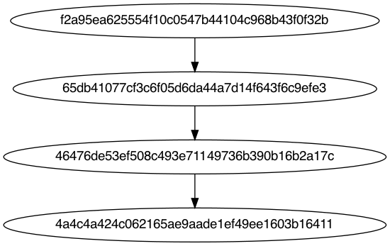

# revng-challenge



## Usage

```sh
GITHUB_ACCESS_TOKEN=<token> python generate.py
```

The program will prompt for the following

- repository
- Owner of the repository / Organisation

After they are provided, the program should fetch recent commits and generate an out.dot file and an output.png

n.b The token can be either

- An app user access token
- An app installation access token
- A fine grained personal access token